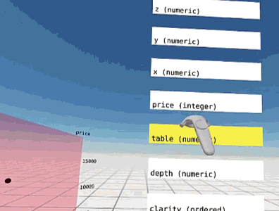

# Adit: Enter the Data Mine

Adit is a tool for exploratory data analysis that brings together 
the R language for statistical computing and virtual reality via 
[shiny](https://shiny.rstudio.com/) and [A-frame](http://aframe.io).

[Click for full video preview](https://youtu.be/vy8e8zIi4qw)

## Motivation

In the modern, data-rich world, analysts and data scientists seek to gain 
insights from data sets of ever-increasing complexity. A key step in the
process is exploratory data analysis, getting to know the data and discovering
variable relationships, yet current, 2-D technology limits the ability to
visualize the relationships and interactions of many variables. 

Adit opens the door to true 3-D data exploration with the HTC Vive. 
Stereo vision with positional tracking provide a link to human spatial
understanding that cannot be imitated on the desktop monitor, 
and hand controls provide an intuitive
experience. Together, these allow for rapid data exploration and insight 
discovery. 

## Current Status

With Adit, you can build and examine exploratory data visualizations 
interactively in VR.
Upload a dataset or choose an example one. 
Build histograms, scatter plots, and 3-d scatter plots by dragging
variable name cards and dropping them on the desired axes. 
You can also map data to shape, color, and size of the points in the plot by dropping variable name cards on the 
corresponding legends.

To examine the plot, 
grab it to move and rotate it with a controller. 
If you release it with a twist of the wrist, the plot
will remain animated in a spin. 
You can also grab the plot with two hands to stretch or shrink it.

### The Future

Since WebVR is already online, shared experiences are a natural addition so that 
colleagues from across the globe could join 
each other to explore data together. WebVR is also multi-platform, so 
colleagues or clients could join with mobile VR or even desktop monitors for you
to show them what you've discovered. 

## Try Adit Now

**You can experience Adit by visiting http://wmurphyrd.shinyapps.io/adit.** 

### Requirements
Adit requires a complete VR system (rotational & positional tracking with
hand controllers). With the recent release of A-Frame v0.4.0, 
Oculus Rift + Touch has joined the HTC Vive
in offering this experience. I will be updating A-Frame to v0.4.0 in 
the near future.

WebVR is still experimental and only available in test versions of browsers. 
Currently, only [Chromium](https://webvr.info/get-chrome/) 
supports the full experience with hand controllers. Also, I'm recommending
[the September 23rd archived Chromium build](https://drive.google.com/drive/folders/0BzudLt22BqGRbHdGOTdiaTBkZXM) 
for Adit because the latest version doesn't always get along with physics. 

After installing Chromium, you **must** enable two options for WebVR to work:

* chrome://flags/#enable-webvr
* chrome://flags/#enable-gamepad-extensions

### Features and Updates

* File uploader control to provide your own data
* Guides for color, shape, and size
    * View the current mappings to non-position aesthetics
    * Drag-and-drop `data-frame-column` onto the guide to update the mapping
* 1-D and 2-D plots: when building a new plot from scratch, the Adit plot
  will show you the intermediate steps. Try changing the dataset selection 
  to "mtcars" or "diamonds" to see this in action. 
    * The first variable mapped will produce
      a dot-histogram showing the distribution of that variable 
      (try it on the `y` and `z` axes, too!)
    * With two variables mapped, a 2-D scatter plot will display 
      (centered on whichever the 3rd, unmapped axis is)
* `stretch` component allows for two-handed grab and stretch of entities.
    * Efficient direct update of physics bodies to match scale
* Scales for plots: added `plot-axis-text` component. This will be automatically
  added to a `plot` and label x, y, and z axes. Supports numeric labels and text
  labels for factors. Labels the name of the mapped variable as the scale title.
* Performance improvements
    * Plot updates are queued and completed as time is available to avoid 
      locking out the render thread
    * Plot points are updated rather than destroyed and recreated (and the 
      updates are not accomplished with an animation)
    * New `physics-collider` component is drop-in replacement for 
      `sphere-collider` that uses the `physics` engine's existing 
      collision detection instead of calculating its own collisions
* Interactive plot building: plots can now be built within Adit by dragging
  data columns onto the axes.
    * `drag-drop` component for controllers. Tells targets when they are
      hovered over and tells targets and carried entities when a successful
      drag-and-drop interaction occurs. 
    * `data-frame` component receives data from
      [shinyaframe](http://github.com/wmurphyrd/shinyaframe) 
      `aDataFrame` widget and creates `data-frame-column` entities that
      can be dragged onto plot axes to update mapping
* `plot` components
    * `plot`: contains `plot-area`, creates and manages x, y, and z
      `plot-axis` components
    * `plot-axis`: target for `drag-drop`, highlights when hovered 
    * `plot-area`: receives data from
      [shinyaframe](http://github.com/wmurphyrd/shinyaframe) 
      `aScatter3d` widget
      and manages data point display
* `collision-filter` component and system to easily
  manage collision groups (which objects have physics interactions
  with each other and  which don't) via `CANNON.js` settings
  `collisionFilterGroup` and `collisionFilterMask`
* `sleepy` component to utilize 
  `CANNON.js` built-in sleepiness
  and control damping. In WebVR Chromium 56, this can cause `dynamic-body` 
  entities to be obliterated. Can use v55 WebVR build instead.
    * With default settings, objects quickly come to rest after
      after release regardless of release velocity.
    * Changing angularDamping to 0 and increasing the speedLimit creates
      a situation where objects released with a twist will cease linear
      translation but maintain their rotational spin indefinitely
* Using [aframe-physics-system](https://github.com/donmccurdy/aframe-physics-system)
  and [aframe-extras](https://github.com/donmccurdy/aframe-extras) 
  from @donmccurdy for improved grabbing (rotation & position) via `CANNON.js`
  constraints

  
